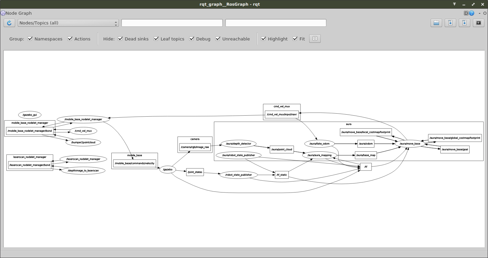

# Aura_VR-fira

## Compile and run:
`./compile.bash`

`./setup.bash`

### To run server, gazebo and world
`roslaunch turtlebot_gazebo turtlebot_world.launch world_file:=/home/username/current_dir/world/world1-1.launch`
##### For other world replace `world1-1` with world name in world directory
### To run client
`python how_to_run.py mode start`
#### Args:
##### mode: for speed of robot
<b>pass 1 for fast and 2 for slow</b>
##### start: for start quickly or wait for input (recommended)
<b>pass anything you want it doesn't matter</b>
#### NOTE:
<b> If you don't pass anything robot speed will fast and wait for input for to start</b>

## Optional
##### You can run `rviz` for see details, map and plan

## `rqt_graph`

